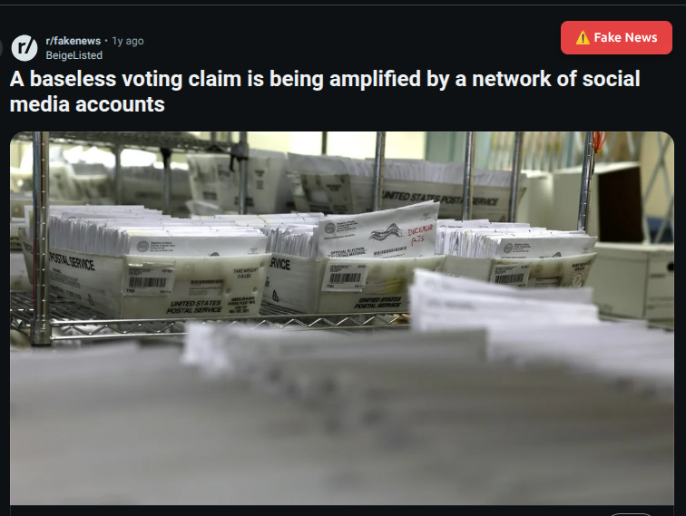
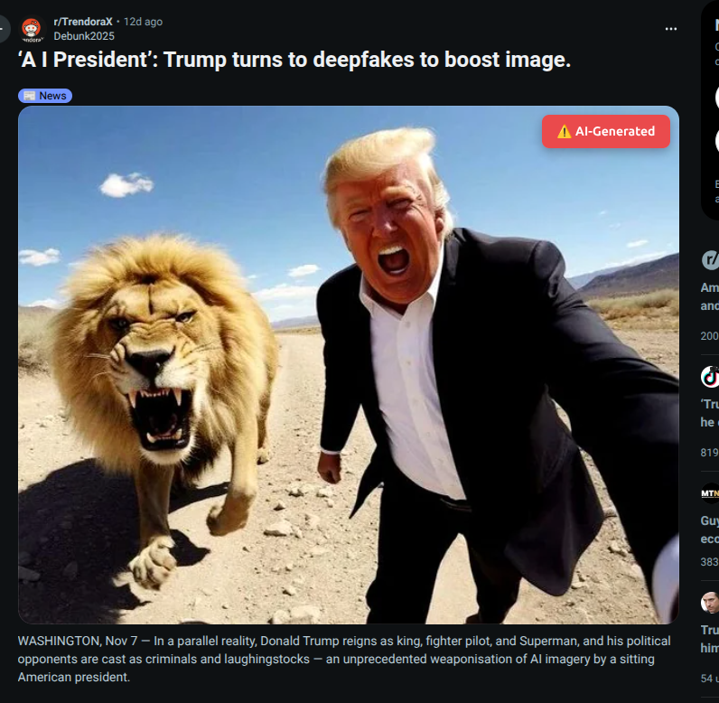
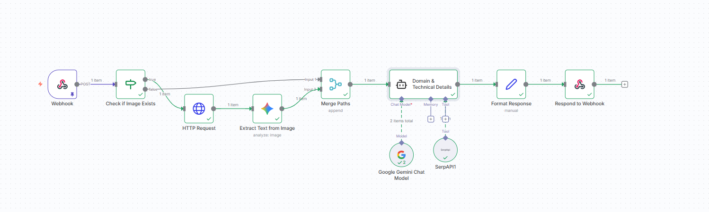

# Reddit Fake-News Detector Extension

## Features

-   Detect AI-generated images on Reddit posts
-   Analyze Reddit posts for potential fake news content
-   Provide visual indicators for AI-generated images and fake news
-   Works seamlessly on Reddit's website

> **Note**: This extension is specifically designed to work on Reddit for the moment (for prototyping purposes).

> **Warn** : If app does not work as expected, because we use **Free Api Keys** for prototyping purposes, the API limits might have been reached.

---

## Installation Instructions

### For Chrome:

1. Build the extension (already done):

    ```bash
    npm run build
    ```

2. Open Chrome and go to: `chrome://extensions/`

3. Enable **Developer mode** (toggle in the top right)

4. Click **Load unpacked**

5. Select the `dist` folder from this project

6. The extension is now installed!

### For Firefox:

1. Build the extension (already done):

    ```bash
    npm run build
    ```

2. Open Firefox and go to: `about:debugging#/runtime/this-firefox`
3. Click **Load Temporary Add-on**
4. Select the `dist/manifest.json` file from this project
5. npmThe extension is now installed!

---

## How to Use

1. Navigate to reddit.com and browse posts as usual.
2. When you hover over a post with an AI-generated image or potential fake news content, visual indicators will appear.




## Development Tools

1. TypeScript for extension logic
2. We used N8N which is a NEW INNOVATIVE AI TOOL, we created a workflow, it is triggered by a webhook sent by the extension which contains the text, and the image_url of the reddit post, the workflow checks if there is an image and if yes it downloads it and sends it to GEMINI model, this model extracts the text from the image, then the workflow sends the full text prompt containing the reddit text + the text extracted from the image to the AI AGENT, this agent uses GEMINI LLM as its BRAIN and uses SERPAPI as TOOL search, it then facts checks the information and sends the result to the extension which contains if this news is fake or not
3. Sightengine API for image analysis (AI-generated detection)


